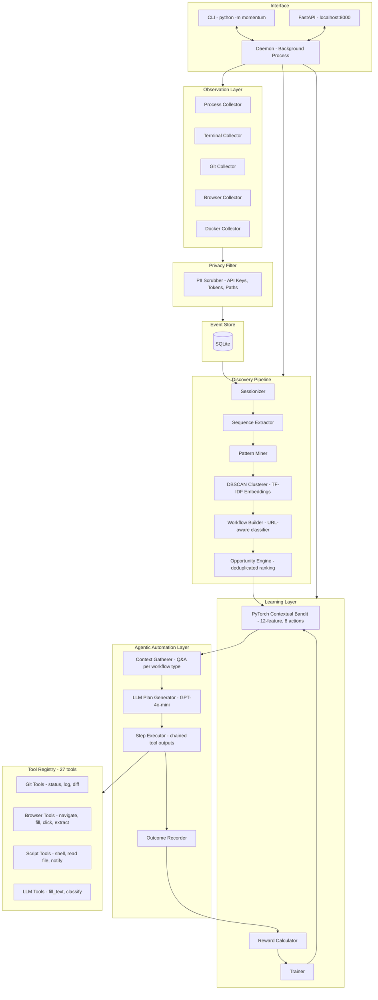

<div align="center">

# ⚡ MOMENTUM

**A local AI daemon that observes how you work, discovers repetitive workflows autonomously — including LinkedIn job applications, email triage, standups, and dev ops — then uses an LLM agent to build and activate a custom automation with one approval.**

[](https://python.org)
[](https://pytorch.org)
[](https://fastapi.tiangolo.com)
[](https://playwright.dev)
[](https://sqlite.org)
[](LICENSE)
[]()
[]()

<br/>

> *You never tell MOMENTUM what to automate. It figures that out itself — then builds the automation using an AI agent.*

</div>

---

## Overview

MOMENTUM sits silently on your machine and observes how you work — terminal commands, git operations, CI events, browser navigation, form submissions. After enough observation it clusters your behaviour into recurring workflows, evaluates which ones are worth automating, and asks you **one targeted question per workflow type** before handing everything to an LLM agent that generates a fully custom automation plan.

The system has **no predefined automation rules**. Every workflow it discovers is inferred from your actual behaviour. Every automation plan is generated by an LLM from scratch, using your answers and the observed step sequence.

### Core Loop

```
OBSERVE → LEARN → DISCOVER → EVALUATE → RECOMMEND → APPROVE → AUTOMATE → EXECUTE → MEASURE → REWARD → LEARN
```

---

## Architecture



---

## What MOMENTUM Can Discover and Automate

| Workflow Type | Example | How it automates |
|---|---|---|
| **LinkedIn Job Applications** | Open LinkedIn → search → fill Easy Apply → submit (14x/week) | Playwright navigates headlessly, LLM classifies job relevance, form auto-filled |
| **Email Triage** | Open Gmail → archive → label → reply (daily) | Browser automation opens inbox, LLM drafts replies, notification on completion |
| **Daily Standup Prep** | git log → check CI → open PRs → write Slack message | Shell commands collect context, LLM generates standup text, posts to Slack |
| **Jira Ticket Creation** | Open Jira → fill title, description, assignee → submit | Browser fills form fields, LLM generates description from context |
| **Dependency Updates** | npm outdated → open changelog → upgrade → test | Shell commands, browser for changelog, run tests |
| **Meeting Prep** | Open calendar → open Notion → open relevant PRs | Browser navigation sequence, LLM generates agenda |
| **CI Failure Investigation** | CI fails → check logs → find commit → notify team | Git tools + GitHub API + draft message |
| **PR Review** | PR opened → diff → check CI → draft feedback | GitHub API tools chain |
| **Any other pattern** | Whatever you do repeatedly | LLM generates custom plan from observed steps + your answers |

---

## Quick Start

### Prerequisites

- Python 3.10+
- Windows (PowerShell), macOS, or Linux

### Installation

```bash
git clone https://github.com/Ujjwal-Bajpayee/MOMENTUM
cd momentum
pip install -e .
python -m playwright install chromium
```

> **Windows users:** Set `$env:PYTHONUTF8=1` in your PowerShell session. Add it to your `$PROFILE` to make it permanent.

### Simulation Mode (Try it now — no real data needed)

```bash
# Windows
$env:PYTHONUTF8=1
python -m momentum simulate --days 7

# macOS / Linux
PYTHONUTF8=1 python -m momentum simulate --days 7
```

Walk through the full loop:

```bash
python -m momentum opportunities                   # See all discovered workflows ranked
python -m momentum inspect <workflow_id>           # Deep-dive
python -m momentum approve <workflow_id>           # Q&A + LLM plan + activate
python -m momentum automations                     # List active automations
python -m momentum run <automation_id>             # Trigger manually
```

### Live Daemon Mode

```bash
python -m momentum start          # Begin observing your real work
python -m momentum status         # Check observation progress
python -m momentum opportunities  # Surface discoveries (after ~7 days)
python -m momentum stop           # Graceful shutdown
```

---

## The Approval Flow

When you approve an opportunity, MOMENTUM does not use a static template. It:

**1. Gathers context interactively:**
```
MOMENTUM detected: LinkedIn Job Application (14x/week, ~8 min each)

To build your automation I have a few questions:
  1. What site or tool is this on?          > linkedin.com
  2. What is the goal?                      > Apply for Python/ML engineering roles
  3. Any filters?                           > Remote only, salary >$100k
  4. Resume location?                       > ~/Documents/resume.pdf
  5. Confirm before each submission?        > yes
```

**2. Sends the observed step sequence + your answers to GPT-4o-mini:**

The LLM receives the actual event sequence (navigate, fill, submit × 10 occurrences), your answers, and the full tool registry schema — and generates a JSON plan using only real tools.

**3. Shows you the generated plan:**
```
(Generated by: gpt-4o-mini)

Automation name    LinkedIn Easy Apply Loop
Description        Navigate LinkedIn jobs, score relevance, auto-apply with resume
Trigger            0 9 * * 1-5  (9am weekdays)
Est. time saved    45 min/run

Steps:
  1. browser_navigate    — Open LinkedIn job search with filters
  2. browser_extract_text — Extract job listing titles and descriptions
  3. llm_classify        — Score each listing for relevance to your criteria
  4. browser_navigate    — Navigate to top-scored listing
  5. browser_fill_form   — Auto-fill application form with resume data   [CONFIRM]
  6. browser_click       — Submit Easy Apply                             [CONFIRM]
  7. send_notification   — "Applied to: <job title>"

Risks:
  ⚠ May apply to borderline roles if classifier threshold is too permissive

Approve and activate this automation? [y/N]:
```

> **Without an API key:** For generic workflows (LinkedIn, email, etc.) MOMENTUM will tell you: *"An API key is required to generate a custom plan for this workflow type."* For known developer workflows (CI, PR, git), it falls back to the offline heuristic plan. The API key is saved to `~/.momentum/config.json` after first entry — you only enter it once.

---

## CLI Reference

| Command | Description |
|---|---|
| `python -m momentum start` | Start the background observation daemon |
| `python -m momentum stop` | Gracefully stop the daemon |
| `python -m momentum restart` | Restart the daemon |
| `python -m momentum pause` | Pause observation |
| `python -m momentum resume` | Resume observation |
| `python -m momentum status` | Daemon health, policy stats, discovery counts |
| `python -m momentum simulate [--days N] [--seed N] [--clean]` | Inject synthetic activity and run the full pipeline |
| `python -m momentum report` | Full observation report with time-cost breakdown |
| `python -m momentum opportunities` | Ranked automation candidates (deduplicated, one per type) |
| `python -m momentum inspect <id>` | Detailed workflow inspection |
| `python -m momentum approve <id>` | Context Q&A → LLM plan → activate |
| `python -m momentum reject <id>` | Reject candidate (negative reward, policy updates) |
| `python -m momentum automations` | List all active automations with execution stats |
| `python -m momentum run <id>` | Manually trigger an automation |
| `python -m momentum learn` | Run a training pass over all historical outcomes |
| `python -m momentum privacy` | View and configure data collection settings |
| `python -m momentum reset` | Wipe all collected data and reset state |

---

## Configuration

Set via environment variables or a `.env` file in the project root:

```env
# Storage
MOMENTUM_DB=~/.momentum/momentum.db
MOMENTUM_STATE_FILE=~/.momentum/state.json

# Observation
MOMENTUM_OBSERVATION_DAYS=7

# LLM — required for generic workflow automation (LinkedIn, email, etc.)
# Saved to ~/.momentum/config.json after first entry; not needed every run
MOMENTUM_LLM_PROVIDER=openai
MOMENTUM_LLM_API_KEY=sk-...
MOMENTUM_LLM_MODEL=gpt-4o-mini

# Embeddings
MOMENTUM_EMBEDDING_MODEL=tfidf

# Logging
MOMENTUM_LOG_LEVEL=INFO
```

**API key behaviour:**
- If set here or as `OPENAI_API_KEY` — used automatically
- If not set — prompted once during `approve`, then saved to `~/.momentum/config.json`
- For known developer workflows (CI, PR, git) — API key is optional, offline fallback available
- For generic workflows (LinkedIn, email, etc.) — **API key is required**

---

## Tool Registry (27 tools)

| Category | Tools |
|---|---|
| **Git** | `git_status`, `git_log`, `git_diff`, `search_repository`, `run_tests` |
| **GitHub** | `get_github_pull_request`, `get_github_commit`, `get_github_ci`, `find_code_owner` |
| **Communication** | `create_draft_message`, `create_draft_issue`, `generate_release_notes`, `summarize_incident` |
| **Browser** (Playwright, headless) | `browser_navigate`, `browser_extract_text`, `browser_fill_form`, `browser_click`, `browser_screenshot` |
| **Script** | `run_shell_command`, `read_file`, `write_file`, `send_notification` |
| **LLM** | `llm_fill_text` (cover letters, standup messages), `llm_classify` (relevance scoring) |

The LLM plan generator receives the full tool schema and can only generate plans using tools that actually exist in the registry. Invalid tool references are stripped before the plan is shown.

---

## How It Works

### 1. Observation
Background collectors stream events into SQLite. A privacy filter scrubs API keys, tokens, passwords, and sensitive paths before storage.

### 2. Sessionization
Raw events are grouped into work sessions using a 5-minute inactivity gap. Each session captures app sequence, repository context, and duration.

### 3. Discovery
Sessions are TF-IDF embedded and DBSCAN clustered. Each cluster = one discovered workflow. A URL-aware classifier identifies the workflow type from observed targets (e.g. `linkedin.com/jobs/apply` → LinkedIn Job Application). Duplicate clusters of the same workflow type are deduplicated — only the highest-confidence instance per type is surfaced.

### 4. Evaluation
Each workflow is scored across four dimensions: repetition, determinism, risk, and time cost. The contextual bandit decides which to surface and at what confidence.

### 5. Context Gathering
Before building an automation, MOMENTUM asks you targeted questions based on the workflow type: what site, what goal, any filters, what files are needed, confirm before actions.

### 6. LLM Plan Generation
Your answers + the observed step sequence + the tool registry schema are sent to GPT-4o-mini. It returns a JSON plan: steps, trigger (schedule/event/manual), risks, and which steps need your confirmation. Only real tools are used.

### 7. Agentic Execution
The executor runs steps sequentially. Tool outputs chain into subsequent step inputs (e.g. `browser_extract_text` feeds into `llm_classify` feeds into `browser_fill_form`). Steps marked `requires_confirmation` pause and ask before executing. All runs headlessly via Playwright.

### 8. Reward and Learning
Each execution outcome scores the bandit: success, time saved, human intervention rate. The policy improves. Automations that consistently work gain autonomy.

---

## Project Structure

```
momentum/
├── agents/           interpreter_agent.py (LLM plan gen), context_gatherer.py (Q&A)
├── api/              FastAPI control plane (REST + WebSocket)
├── automation/       Plan validator, replay engine
├── collectors/       Process, terminal, git, browser, docker collectors
├── config/           Settings + persistent API key storage
├── daemon/           Background daemon and state management
├── database/         SQLite + SQLAlchemy session factory
├── discovery/        Sessionizer, pattern miner, DBSCAN clusterer, workflow builder
├── embeddings/       TF-IDF encoder and FAISS vector store
├── execution/        Agentic step executor and outcome recorder
├── learning/         PyTorch contextual bandit, reward calculator, trainer
├── memory/           Semantic workflow memory
├── models/           SQLAlchemy ORM models
├── permissions/      Permission registry and gate enforcement
├── policy/           Autonomy policy engine
├── privacy/          PII filter
├── reporting/        Report and opportunity formatters
├── simulation/       7-day synthetic activity generator (10 workflow types)
├── sessions/         Session manager
└── tools/            git_tools.py, browser_tools.py, script_tools.py, llm_tools.py, registry.py
tests/
├── test_bandit.py
├── test_models.py
├── test_privacy.py
├── test_sessionizer.py
└── test_simulation.py
```

---

## API

The FastAPI control plane runs at `http://localhost:8000` when the daemon is active.

| Endpoint | Method | Description |
|---|---|---|
| `/health` | GET | Daemon health check |
| `/events` | GET | Query collected events |
| `/workflows` | GET | List discovered workflows |
| `/opportunities` | GET | List automation opportunities |
| `/automations` | GET | List active automations |
| `/automations/{id}/run` | POST | Trigger an automation |
| `/learning/stats` | GET | Bandit policy statistics |
| `/privacy` | GET | Privacy configuration |

**Interactive docs:** `http://localhost:8000/docs`

---

## Docker

```bash
docker-compose up --build
```

---

## Testing

```bash
pytest tests/ -v
pytest tests/ -v --cov=momentum --cov-report=term-missing
```

---

## Design Principles

- **No predefined automation rules.** Every candidate is inferred from observed behaviour. Every plan is generated by an LLM from your specific workflow.
- **You always approve.** MOMENTUM never executes without explicit confirmation. Steps that write data or submit forms pause for your sign-off.
- **Generic by design.** Discovers any workflow — developer tools, job boards, email, project management, anything a browser or terminal can reach.
- **Offline core.** Observation, discovery, and learning work with zero internet. An API key is only needed at approval time, for novel workflow types.
- **Privacy by default.** All sensitive data is scrubbed before storage. Nothing leaves your machine.
- **Learns from outcomes.** Every result feeds the bandit. The system improves over time.

---

## License

MIT (c) 2026 MOMENTUM Contributors
