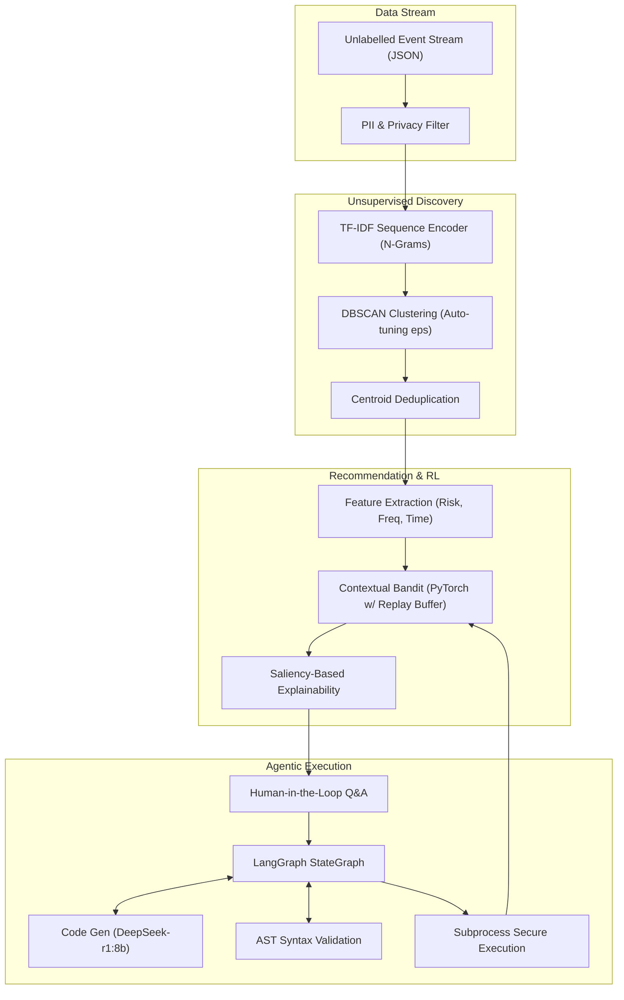

<div align="center">

# ⚡ MOMENTUM

**A privacy-first, human-in-the-loop Agentic ML system that discovers recurring workflows from unlabelled desktop activity data, ranks automation opportunities, and autonomously generates Python automation scripts.**

[](https://python.org)
[](https://pytorch.org)
[](https://scikit-learn.org)
[](https://python.langchain.com/)
[](LICENSE)

</div>

---

## Overview

MOMENTUM is an advanced local-first machine learning system designed to solve the problem of **unsupervised workflow discovery and autonomous automation**. 

By silently observing desktop interactions (e.g., terminal usage, git operations, browser activity), MOMENTUM identifies and learns complex recurring patterns without requiring manual rule definitions. It bridges the gap between raw, noisy event streams and executable automation code through a sophisticated multi-stage AI pipeline.

### Key Features
- **Unsupervised Discovery:** Uses sequence-aware TF-IDF encoding and self-tuning DBSCAN clustering to find hidden workflow patterns in unlabelled data.
- **Contextual Bandit Ranking:** A PyTorch neural network (stabilized via Experience Replay) ranks workflows based on frequency, time cost, risk, and determinism.
- **Explainable AI:** True gradient-based saliency mapping explains exactly *why* the AI recommended a specific workflow.
- **Agentic Code Generation:** Uses **LangGraph** and local LLMs (default: `deepseek-r1:8b` via Ollama) to autonomously write, self-correct, and execute custom Python scripts that automate your daily tasks.
- **100% Local & Private:** All data, embeddings, and models run exclusively on your local hardware.

---

## Architecture

**Goal:** Discover recurring workflows from an unlabelled stream of desktop events, cluster them accurately, rank their automation potential, and build custom automations dynamically.



---

## Quick Start

### Prerequisites
- **Python 3.12+**
- **Windows (PowerShell), macOS, or Linux**
- **[Ollama](https://ollama.com/)** (Required for the Agentic LLM execution)

### 1. Installation

Clone the repository and install the daemon:
```bash
git clone https://github.com/Ujjwal-Bajpayee/MOMENTUM
cd momentum
pip install -e .
```

### 2. Run the Simulation

Generate a week of synthetic data and run the full ML pipeline to observe MOMENTUM in action without touching your real data:

```bash
# Windows
$env:PYTHONUTF8=1
python -m momentum simulate --days 7

# macOS / Linux
PYTHONUTF8=1 python -m momentum simulate --days 7
```

### 3. Explore the Agentic Pipeline

Once the simulation completes, use the CLI to interact with the discovered workflows:

```bash
# 1. Surface discovered automation clusters ranked by the Bandit
python -m momentum opportunities

# 2. View explainable saliency breakdown for a specific opportunity
python -m momentum inspect <opportunity_id>

# 3. Approve a workflow to trigger LangGraph + DeepSeek to generate a Python script!
python -m momentum approve <opportunity_id>

# 4. Execute the generated automation script
python -m momentum run <automation_id>
```

---

## Evaluation & Benchmarks

MOMENTUM includes a built-in synthetic benchmark generator to evaluate clustering and ranking performance safely.

### Clustering Evaluation
We compare the default **TF-IDF Unigram** representation against a sequence-aware **TF-IDF N-gram** model. The DBSCAN hyperparameters are automatically tuned during runtime to maximize cluster coherence.
```bash
python -m momentum benchmark --num-sessions 200
```

### Contextual Bandit Policy Evaluation
Simulate 1,000 workflow contexts to evaluate the PyTorch contextual bandit against static baselines (e.g., Always-Recommend vs. Fixed-Score-Threshold).
```bash
python -m momentum policy-eval --steps 1000
```

---

## Privacy & Data Storage

**Privacy-First Design:**
- **Zero Cloud Dependencies:** All ML models (TF-IDF, DBSCAN, PyTorch Bandit, and Ollama LLMs) run **100% locally**.
- **Data Scrubbing:** Event data is aggressively scrubbed of PII, passwords, and sensitive paths prior to storage.
- **Local Storage:** Everything is stored transparently on your hard drive in a local SQLite database (`~/.momentum/momentum.db`).

---


##  License

MIT (c) 2026 MOMENTUM Contributors
