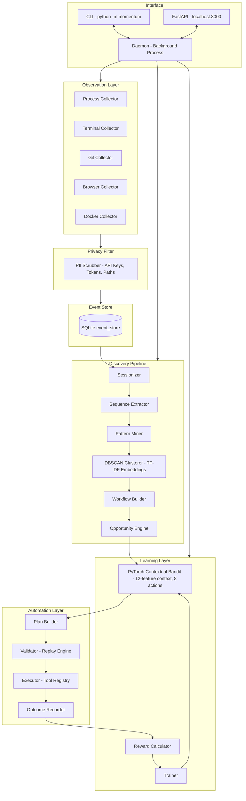

<div align="center">

# ⚡ MOMENTUM

**A local AI daemon that learns how you work, discovers repetitive workflows autonomously, and — with a single approval — builds and activates the automation.**

[](https://python.org)
[](https://pytorch.org)
[](https://fastapi.tiangolo.com)
[](https://sqlite.org)
[](LICENSE)
[]()
[]()

<br/>

> *You never tell MOMENTUM what to automate. It figures that out itself.*

</div>

---

## Overview

MOMENTUM sits silently on your machine and observes how you work — terminal commands, git operations, CI events, browser navigation. After enough observation, it clusters your behaviour into recurring workflows, evaluates which ones are worth automating, explains its reasoning, and asks for **one explicit approval** before doing anything.

The system has **no predefined rules**. Every workflow it discovers is inferred from your actual behaviour. Every automation it proposes is specific to you.

### Core Loop

```
OBSERVE → LEARN → DISCOVER → EVALUATE → RECOMMEND → APPROVE → AUTOMATE → EXECUTE → MEASURE → REWARD → LEARN
```

The policy (a PyTorch contextual bandit) improves with every execution outcome. Automations that save time and succeed get reinforced. Failures reduce confidence and trigger human review.

---

## Architecture



---

## Quick Start

### Prerequisites

- Python 3.10+
- Windows (PowerShell), macOS, or Linux

### Installation

```bash
git clone https://github.com/Ujjwal-Bajpayee/MOMENTUM
cd momentum
pip install -e .
```

> **Windows users:** Set `$env:PYTHONUTF8=1` in your PowerShell session for proper Unicode rendering. Add it to your `$PROFILE` to make it permanent.

### Simulation Mode (Try it now)

Run a full 7-day demo without touching your real workflow:

```bash
# Windows
$env:PYTHONUTF8=1
python -m momentum simulate --days 7

# macOS / Linux
PYTHONUTF8=1 python -m momentum simulate --days 7
```

Then walk through the full loop:

```bash
python -m momentum status                          # Check what was observed
python -m momentum report                          # Full 7-day analysis
python -m momentum opportunities                   # See ranked automation candidates
python -m momentum inspect <workflow_id>           # Deep-dive on a workflow
python -m momentum approve <workflow_id>           # Approve and activate
python -m momentum automations                     # List active automations
python -m momentum run <automation_id>             # Trigger manually
python -m momentum learn                           # Run a learning pass
```

### Live Daemon Mode

```bash
python -m momentum start          # Begin observing your real work
python -m momentum status         # Check observation progress
python -m momentum opportunities  # Surface discoveries (after ~7 days)
python -m momentum stop           # Graceful shutdown
```

---

## CLI Reference

| Command | Description |
|---|---|
| `python -m momentum start` | Start the background observation daemon |
| `python -m momentum stop` | Gracefully stop the daemon |
| `python -m momentum restart` | Restart the daemon |
| `python -m momentum pause` | Pause observation (data collection stops) |
| `python -m momentum resume` | Resume observation |
| `python -m momentum status` | Show daemon health, policy stats, and discovery counts |
| `python -m momentum simulate [--days N] [--seed N] [--clean]` | Inject synthetic activity and run the full pipeline |
| `python -m momentum report` | Generate a full observation report with time-cost breakdown |
| `python -m momentum opportunities` | List ranked automation candidates with confidence scores |
| `python -m momentum inspect <id>` | Detailed inspection of a discovered workflow |
| `python -m momentum approve <id>` | Approve an automation — builds, validates, and activates it |
| `python -m momentum reject <id>` | Reject a candidate (negative reward, policy updates) |
| `python -m momentum automations` | List all active automations with execution statistics |
| `python -m momentum run <id>` | Manually trigger an automation |
| `python -m momentum learn` | Run a training pass over all historical outcomes |
| `python -m momentum privacy` | View and configure data collection settings |
| `python -m momentum reset` | Wipe all collected data and reset state |

---

## Configuration

Set via environment variables or a `.env` file in the project root:

```env
# Storage
MOMENTUM_DB=~/.momentum/momentum.db
MOMENTUM_STATE_FILE=~/.momentum/state.json

# Observation
MOMENTUM_OBSERVATION_DAYS=7

# LLM (optional — fully functional in offline mode)
MOMENTUM_LLM_PROVIDER=openai
MOMENTUM_LLM_API_KEY=sk-...
MOMENTUM_LLM_MODEL=gpt-4o-mini

# Embeddings
MOMENTUM_EMBEDDING_MODEL=tfidf

# Logging
MOMENTUM_LOG_LEVEL=INFO
```

> **LLM is optional.** Without an API key, MOMENTUM uses deterministic offline interpretation for all workflow analysis, naming, and summarization. All core functionality is available offline.

---

## How It Works

### 1. Observation
Background collectors (process, terminal, git, browser, Docker) stream events into a local SQLite store. All data passes through a privacy filter that scrubs API keys, tokens, passwords, and sensitive paths before storage.

### 2. Sessionization
Raw events are grouped into developer work sessions using a 5-minute inactivity gap heuristic. Each session captures the application sequence, repository context, and duration.

### 3. Discovery
Sessions are embedded using TF-IDF over event sequences and clustered with DBSCAN. Each cluster represents a recurring workflow. The system infers a name, trigger, goal, and step sequence without any labelling.

### 4. Evaluation
Each discovered workflow is scored across four dimensions:

- **Repetition score** — how often it recurs
- **Determinism score** — how consistent the step sequence is
- **Risk score** — whether it involves write operations, communication, or deployment
- **Confidence** — cluster coherence multiplied by evidence count

### 5. Policy (Contextual Bandit)
A PyTorch neural network takes a 12-feature context vector (frequency, duration, determinism, risk, etc.) and outputs Q-values over 8 automation actions. The policy selects which opportunities to surface and with what autonomy level. Exploration decays from epsilon=0.3 toward epsilon=0.1 as the bandit gains experience.

### 6. Approval and Execution
MOMENTUM builds an automation plan and validates it against observed replay sessions before prompting for approval. Once approved, it executes using a controlled tool registry (git, GitHub, CI, Docker, communication — all sandboxed with permission gates).

### 7. Reward and Learning
After each execution, a deterministic reward function scores the outcome based on success, time saved, human intervention rate, and confidence change. The bandit updates its weights via gradient descent. Automations that consistently succeed gain autonomy; those that fail are flagged for review.

---

## Project Structure

```
momentum/
├── api/              FastAPI control plane (REST + WebSocket)
├── agents/           LangGraph interpreter agent (LLM + offline fallback)
├── automation/       Plan builder, validator, replay engine
├── collectors/       Activity collectors (process, terminal, git, browser, docker)
├── config/           Settings and environment management
├── daemon/           Background daemon process and state management
├── database/         SQLite setup and session factory
├── discovery/        Sessionizer, pattern miner, DBSCAN clusterer, workflow builder
├── embeddings/       TF-IDF encoder and FAISS vector store
├── execution/        Automation executor and outcome recorder
├── learning/         PyTorch contextual bandit, reward calculator, trainer
├── memory/           Semantic workflow memory
├── models/           SQLAlchemy ORM models
├── permissions/      Permission registry and gate enforcement
├── policy/           Autonomy policy engine
├── privacy/          PII filter and privacy configuration
├── reporting/        Report and opportunity formatters
├── simulation/       7-day synthetic developer activity generator
├── sessions/         Session manager and sessionizer
└── tools/            Controlled tool registry (git, GitHub, CI, Docker, comms)
tests/
├── test_bandit.py
├── test_models.py
├── test_privacy.py
├── test_sessionizer.py
└── test_simulation.py
```

---

## API

The FastAPI control plane runs at `http://localhost:8000` when the daemon is active.

| Endpoint | Method | Description |
|---|---|---|
| `/health` | GET | Daemon health check |
| `/events` | GET | Query collected events |
| `/workflows` | GET | List discovered workflows |
| `/opportunities` | GET | List automation opportunities |
| `/automations` | GET | List active automations |
| `/automations/{id}/run` | POST | Trigger an automation |
| `/learning/stats` | GET | Bandit policy statistics |
| `/privacy` | GET | Privacy configuration |

**Interactive docs:** `http://localhost:8000/docs`

---

## Docker

```bash
docker-compose up --build
```

The compose stack runs the daemon and exposes the API on port 8000. Data is persisted to a named volume.

---

## Testing

```bash
pytest tests/ -v
pytest tests/ -v --cov=momentum --cov-report=term-missing
```

---

## Design Principles

- **No predefined rules.** Every automation candidate is inferred from observed behaviour, not from a template library.
- **You always approve.** MOMENTUM never executes an automation without explicit human confirmation.
- **Offline first.** The entire core pipeline — observation, discovery, policy, execution — works with zero internet connectivity or API keys.
- **Privacy by default.** All sensitive data (keys, tokens, passwords) is scrubbed before storage. Nothing leaves your machine.
- **Learns from outcomes.** Every execution result feeds back into the bandit. The system improves the longer it runs.

---

## License

MIT (c) 2026 MOMENTUM Contributors
