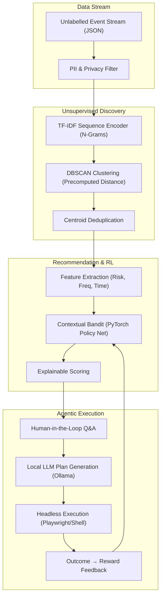

<div align="center">

# ⚡ MOMENTUM

**A privacy-first, human-in-the-loop ML system that discovers recurring workflows from unlabelled desktop activity data, ranks which workflows are worth automating, explains its recommendations, and improves from feedback.**

[](https://python.org)
[](https://pytorch.org)
[](https://scikit-learn.org)
[](LICENSE)

</div>

---

## 📖 Overview

MOMENTUM is an advanced machine learning system designed to solve the problem of **unsupervised workflow discovery** from unlabelled event streams. By silently observing desktop interactions (e.g., terminal usage, git operations, browser activity), MOMENTUM identifies and learns complex recurring patterns without requiring manual rule definitions.

Leveraging a robust pipeline of NLP and clustering techniques, MOMENTUM autonomously discovers workflows. A PyTorch-based neural contextual bandit then ranks these discoveries based on key automation metrics—including frequency, time cost, risk, and determinism. It explains its reasoning to the user and dynamically improves its policy based on human approval or rejection feedback.

Finally, integrating with local LLMs via Ollama, MOMENTUM generates and executes custom automation plans tailored to the discovered workflows.

---

## Architecture

**Goal:** Discover recurring workflows from an unlabelled, noisy stream of desktop events, cluster them accurately, rank their automation potential, and build custom automations.



---

## Evaluation & Benchmarks

MOMENTUM includes a built-in synthetic benchmark generator to evaluate clustering and ranking performance without compromising user privacy.

### Clustering Baseline Comparison
We compare the default **TF-IDF Unigram** representation against a sequence-aware **TF-IDF N-gram** model using the same DBSCAN hyperparameters (`eps=0.35, min_samples=3`).

Run the benchmark:
```bash
python -m momentum benchmark --num-sessions 200
```

| Metric | TF-IDF Unigram | TF-IDF N-gram |
|:---|:---:|:---:|
| **Adjusted Rand Index (ARI)** | ~0.81 | ~0.75 |
| **Normalized Mutual Info (NMI)**| ~0.86 | ~0.86 |
| **Cluster Purity** | 1.000 | 0.833 |
| **Signal Coverage** | ~0.93 | ~0.95 |
| **Noise Rate** | ~0.19 | ~0.07 |

### Contextual Bandit Policy Evaluation
We simulate 1,000 workflow contexts to evaluate the PyTorch contextual bandit against static baselines (e.g., Always-Recommend vs. Fixed-Score-Threshold).

Run the policy evaluation:
```bash
python -m momentum policy-eval --steps 1000
```

---

## Privacy & Limitations

**Privacy-First:**
- All ML models (TF-IDF, DBSCAN, Bandit, and Ollama LLMs) run **100% locally**.
- Event data is aggressively scrubbed of PII, passwords, and sensitive paths prior to storage.
- No external API calls are made during the workflow discovery, ranking, or automation generation process.

**Known Limitations & Disclosures:**
1. **Synthetic-Only Validation:** The current benchmarking suite relies on a synthetic event generator. The distribution of synthetic events may contain gaps when compared to real-world, highly chaotic desktop usage. 
2. **Cold Start Period:** The system requires approximately 3-7 days of observation to accumulate sufficient data density for DBSCAN to form meaningful clusters.
3. **Evaluation Data:** The clustering ARI/NMI metrics are computed using synthetic labels and have not yet been validated on a human-annotated real-world dataset.

---

## Quick Start

### Prerequisites
- Python 3.12 or higher
- Windows (PowerShell), macOS, or Linux
- [Ollama](https://ollama.com/) (For local LLM execution)

### Installation

Clone the repository and install the daemon:
```bash
git clone https://github.com/Ujjwal-Bajpayee/MOMENTUM
cd momentum
pip install -e .
```

### Simulation Mode

Generate a week of synthetic data and run the full ML pipeline to observe MOMENTUM in action:

```bash
# Windows
$env:PYTHONUTF8=1
python -m momentum simulate --days 7

# macOS / Linux
PYTHONUTF8=1 python -m momentum simulate --days 7
```

### Exploring the Pipeline

```bash
python -m momentum opportunities                   # Surface discovered automation clusters
python -m momentum inspect <opportunity_id>        # View explainable score breakdown for a specific opportunity
python -m momentum evaluate                        # Run clustering evaluation against synthetic labels
python -m momentum benchmark                       # Compare TF-IDF baseline methodologies
python -m momentum policy-eval                     # Evaluate the RL policy performance
```

---

## Configuration

Configure MOMENTUM by setting variables in a `.env` file at the root of the project:

```env
# Storage
MOMENTUM_DB=~/.momentum/momentum.db

# ML Configuration
MOMENTUM_EPSILON=0.15          # Bandit exploration rate
MOMENTUM_LEARNING_RATE=0.001   # Bandit learning rate
MOMENTUM_EMBEDDING_MODEL=tfidf # Sequence embedding strategy

# Local LLM Integration
MOMENTUM_LLM_PROVIDER=ollama
MOMENTUM_LLM_MODEL=phi4
```

---

## License

MIT (c) 2026 MOMENTUM Contributors
