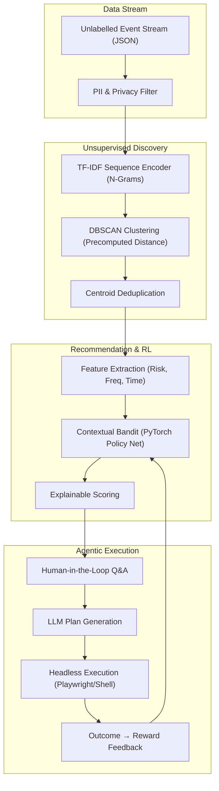

<div align="center">

# ⚡ MOMENTUM

**A privacy-first, human-in-the-loop ML system that discovers recurring workflows from unlabelled desktop activity data, ranks which workflows are worth automating, explains its recommendations, and improves from feedback.**

[](https://python.org)
[](https://pytorch.org)
[](https://scikit-learn.org)
[](LICENSE)

<br/>


</div>

---

## Overview

MOMENTUM is a machine learning system designed to solve the problem of **unsupervised workflow discovery** from unlabelled event streams. It sits silently on a machine, observes interactions (terminal, git, browser), and learns patterns. 

Instead of relying on predefined rules, it uses a pipeline of NLP and clustering techniques to discover workflows autonomously. A neural contextual bandit then ranks these discoveries based on their automation potential (frequency, time cost, risk, determinism), explains its reasoning, and learns from human approval/rejection feedback.

Finally, an LLM agent generates and executes custom automation plans based on the discovered sequence.

---

## ML Problem Statement & Architecture

**Goal:** Discover recurring workflows from an unlabelled, noisy stream of desktop events, cluster them accurately, rank their automation potential, and build a custom automation.



---

## Evaluation Metrics & Benchmarks

MOMENTUM includes a built-in synthetic benchmark generator to evaluate clustering and ranking performance without compromising user privacy.

### Clustering Baseline Comparison
We compare the default **TF-IDF Unigram** representation against a sequence-aware **TF-IDF N-gram** model using the same DBSCAN hyperparameters (`eps=0.35, min_samples=3`).

Run the benchmark:
```bash
python -m momentum benchmark --num-sessions 200
```

| Metric | TF-IDF Unigram | TF-IDF N-gram |
|---|---|---|
| Adjusted Rand Index (ARI) | ~0.81 | ~0.75 |
| Normalized Mutual Info (NMI)| ~0.86 | ~0.86 |
| Cluster Purity | 1.000 | 0.833 |
| Signal Coverage | ~0.93 | ~0.95 |
| Noise Rate | ~0.19 | ~0.07 |

### Contextual Bandit Policy Evaluation
We simulate 1000 workflow contexts to evaluate the PyTorch contextual bandit against static baselines (Always-Recommend vs Fixed-Score-Threshold).

Run the policy evaluation:
```bash
python -m momentum policy-eval --steps 1000
```

---

## Privacy Design & Limitations

**Privacy-First:**
- All ML models (TF-IDF, DBSCAN, Bandit) run **100% locally**.
- Event data is scrubbed of PII, passwords, and sensitive paths before storage.
- The only external API call occurs at the final step (LLM plan generation), and only for the specific workflow being automated, after explicit user consent.

**Known Limitations & Honest Disclosures:**
1. **Synthetic-Only Validation:** The current benchmark relies entirely on a synthetic event generator. The distribution of synthetic events (while containing noise and variations) likely has a gap compared to real-world, highly chaotic desktop usage. 
2. **Cold Start:** The system requires at least 3-7 days of observation to accumulate enough density for DBSCAN to form meaningful clusters.
3. **No Real-World Test:** The clustering ARI/NMI metrics are computed on synthetic labels and have not been validated on a human-annotated real-world dataset.

---

## Quick Start

### Prerequisites
- Python 3.10+
- Windows (PowerShell), macOS, or Linux

### Installation

```bash
git clone https://github.com/Ujjwal-Bajpayee/MOMENTUM
cd momentum
pip install -e .
```

### Try it now (Simulation Mode)

Generate a week of synthetic data and run the ML pipeline:

```bash
# Windows
$env:PYTHONUTF8=1
python -m momentum simulate --days 7

# macOS / Linux
PYTHONUTF8=1 python -m momentum simulate --days 7
```

Explore the pipeline:
```bash
python -m momentum opportunities                   # Surface discovered clusters
python -m momentum inspect <opportunity_id>        # View explainable score breakdown
python -m momentum evaluate                        # Run clustering evaluation
python -m momentum benchmark                       # Compare TF-IDF baselines
python -m momentum policy-eval                     # Evaluate RL policy
```

*(Note: The LLM agent step (`python -m momentum approve`) requires an OpenAI API key in your `.env` file.)*

---

## Configuration

Set via a `.env` file:

```env
# Storage
MOMENTUM_DB=~/.momentum/momentum.db

# ML Configuration
MOMENTUM_EPSILON=0.15          # Bandit exploration rate
MOMENTUM_LEARNING_RATE=0.001   # Bandit learning rate
MOMENTUM_EMBEDDING_MODEL=tfidf # Sequence embedding strategy

# LLM 
MOMENTUM_LLM_PROVIDER=openai
MOMENTUM_LLM_API_KEY=sk-...
```

---

## License

MIT (c) 2026 MOMENTUM Contributors
